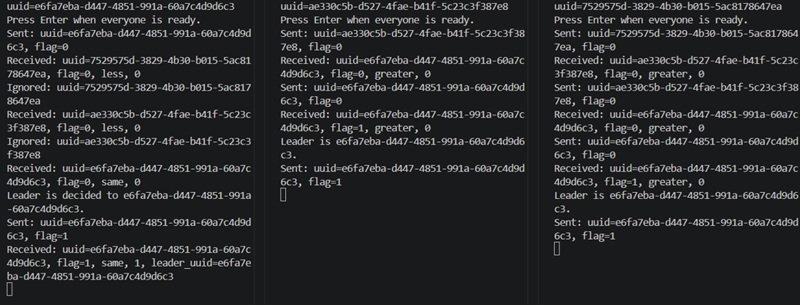

## How to run

### If running with other computers

Verify that the first line of [config.txt](/config.txt) is this computer's IP address and port number separated by a comma, and the second line is the IP address and port number of the computer that this one will connect to. For example:

```
10.1.1.1,5001
10.1.1.2,5001
```

Execute the program:
```bash
python myleprocess.py
```

When all computers are ready, press "Enter" as prompted. The program will connect to the other computer, then wait to be connected to by a different computer before continuing. Once both connections are established, the program will send its initial message, and start the leader election process.

### If running locally (3 processes)

Verify that the files `config1.txt`, `config2.txt`, and `config3.txt` exist before running.

Open [myleprocess.py](./myleprocess.py) and look for the `FILE_SUFFIX` variable. Set it to `"1"`.

Create 3 terminals. In the first one, run:
```bash
python myleprocess.py
```

Then change `FILE_SUFFIX` to `"2"`. Execute the same program in the next terminal. Repeat this process for the last terminal, using `"3"` for `FILE_SUFFIX`.

In each terminal, press "Enter". Each process will run and exchange messages.

Change `FILE_SUFFIX` to `""` to run with other computers again.

As needed, edit the port numbers in the config files, changing the first line's port number to that process' port and the second line's port number to the process that will be connected to. Make sure the config files will form a full ring (i.e., each process connects to the next, with the last connecting to the first). Keep the IP address the same to keep referring to this computer (`127.0.0.1`)

### Sample local output



The output of this run is also shown in `log1.txt`, `log2.txt`, and `log3.txt`.

This output captures the path taken by each process:
- Process 1 connects to process 2, and is connected to by process 3. Process 2 connects to process 3, and is connected to by process 1. Process 3 connects to process 1, and is connected to by process 2.
- Every process sends their ID to their server (1 -> 2, 2 -> 3, 3 -> 1).
- 1 receives 3's ID from 3 and ignores it for being lower.
- 2 receives 1's ID from 1 and forwards it to 3 for being greater.
- 3 receives 2's ID from 2 and forwards it to 1 for being greater.
- 1 receives 2's ID from 3 and ignores it for being lower.
- 3 receives 1's ID from 2 and forwards it to 1.
- 1 receives its own ID from 3, and elects itself as the leader. It forwards this election announcement to 2.
- 2 recognizes this election and forwards it to 3.
- 3 recognizes this election and forwards it to 1.
- 1 receives the election recognition from 2. Since it already forwarded an election message, it does not send another message. Each process is now terminated, with 1's ID recognized as the leader in every process.
